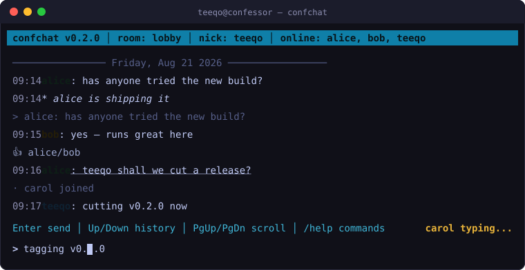
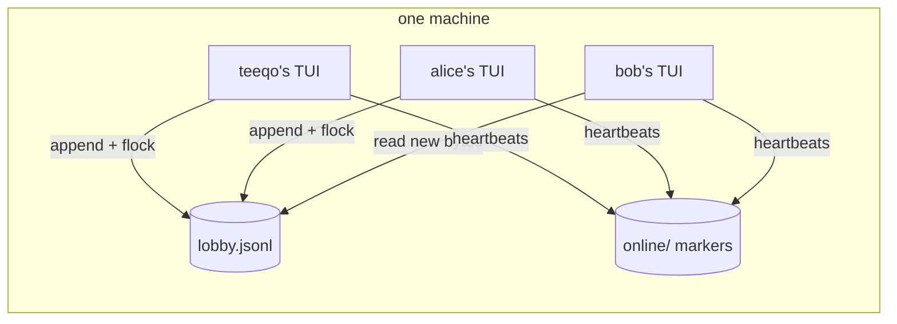

<div align="center">

# confchat

**Real-time chat for everyone on the same machine. No server. No network. No setup.**

[](https://github.com/tanishqsrivastavaa/confchat/actions/workflows/ci.yml)




</div>

---

Shared servers are where teams live — build boxes, GPU rigs, classroom shells,
homelab machines. But talking on one has meant shouting across `wall`, or
standing up a chat server with accounts, ports, and maintenance.

**confchat is a terminal UI that fixes that.** One command and every user on
the box shares a live chat room. Nothing to deploy, nothing to dial out to,
nothing to keep alive.

## Why you'll like it

| | |
|---|---|
| :zap: **Zero infrastructure** | No daemon, no ports, no database. Rooms are plain files shared with `flock`. If the machine runs your shell, it runs your chat. |
| :busts_in_silhouette: **Live presence** | See who's online in the title bar, who's typing in the footer, and get join/part notices as people come and go. |
| :keyboard: **A real editor** | Cursor movement, kill commands, input history, Unicode, and safe multi-line paste. It feels like your shell, not 1979. |
| :speech_balloon: **Actual conversations** | Replies with quoted context, emoji reactions, `/me` actions, mention alerts that flash when someone needs you. |
| :chart_with_downwards_trend: **Stays fast** | Clients read only *new* bytes since their last poll, and rooms auto-rotate around 2 MB. A week-long session stays as snappy as minute one. |
| :lock: **Local by design** | Messages never leave the machine. Perfect for build clusters, air-gapped labs, classrooms, and privacy-conscious homelabs. |

## Quick start

```bash
pipx install git+https://github.com/tanishqsrivastavaa/confchat
confchat --room dev --nick $(whoami)
```

That's it. Teammates on the same host run the same command and you're talking.

Prefer no install? Clone and run:

```bash
git clone https://github.com/tanishqsrivastavaa/confchat && cd confchat
./confchat
```

Admin tip — one symlink gives every account on the box a global `confchat` command:

```bash
sudo ln -sf /path/to/confchat/confchat /usr/local/bin/confchat
```

## How it works

No client-server split, no sockets. Every client is a peer that appends JSON
lines to a shared room file under an advisory lock, and polls for whatever
arrived since it last looked.



Presence works the same way: each client touches a tiny marker file every few
seconds, so "who's online" and "who's typing" fall out of file mtimes — no
state server, nothing to crash.

## Commands

| Command | Effect |
|---|---|
| `/help` | command reference |
| `/reply N text` | reply to message N with quoted context |
| `/react N [emoji]` | react to message N (repeat toggles off) |
| `/me action` | send an action (`* alice ships it`) |
| `/color #6f8f7a` | pick your message color |
| `/nick name` | rename yourself mid-session |
| `/room name` | hop to another room without quitting |
| `/rooms` | list every room on the machine |
| `/clear` | clear room history for everyone |

Message numbers are simply their order on screen — type `/react 2 🎉` and done.

## Keys

| Keys | Action |
|---|---|
| `Enter` | send |
| `Up` / `Down` | input history |
| `Left` / `Right`, `Ctrl-A` / `Ctrl-E` | move cursor |
| `Ctrl-U` / `Ctrl-K` / `Ctrl-W` | clear before / after cursor / delete word |
| `PgUp` / `PgDn`, `Home` / `End` | scroll history / jump to live |
| paste anything | multi-line pastes arrive safely as one message |

## Honest limits

confchat trusts the users of the machine, by design:

- Any local account can read any room's files. **Don't use it for secrets.**
- uid stamps make nick impersonation visible (`alice·1000` vs `alice·1001`),
  but they're self-reported, not OS-enforced.

For what it's for — coordination on a shared box — that trade is the feature.

## FAQ

**Does it work over SSH?**
Beautifully. Each SSH session is just another local user; run it in one pane or ten.

**What about tmux/screen?**
Works fine — each pane is its own client with its own scrollback and presence marker.

**Where does my data live?**
`/var/tmp/confchat-data` as append-only JSONL, one file per room. `cat` it, back it up, delete it — it's yours.

**What happens if two people send at once?**
Writes serialize under `flock`. Nobody's line is ever torn or lost.

## Contributing

Issues and PRs welcome. Development is deliberately boring:

```bash
uv pip install pytest ruff   # or pip
pytest -q                    # 36 tests, no mocks needed
ruff check .
```

## License

MIT — see [LICENSE](LICENSE).
